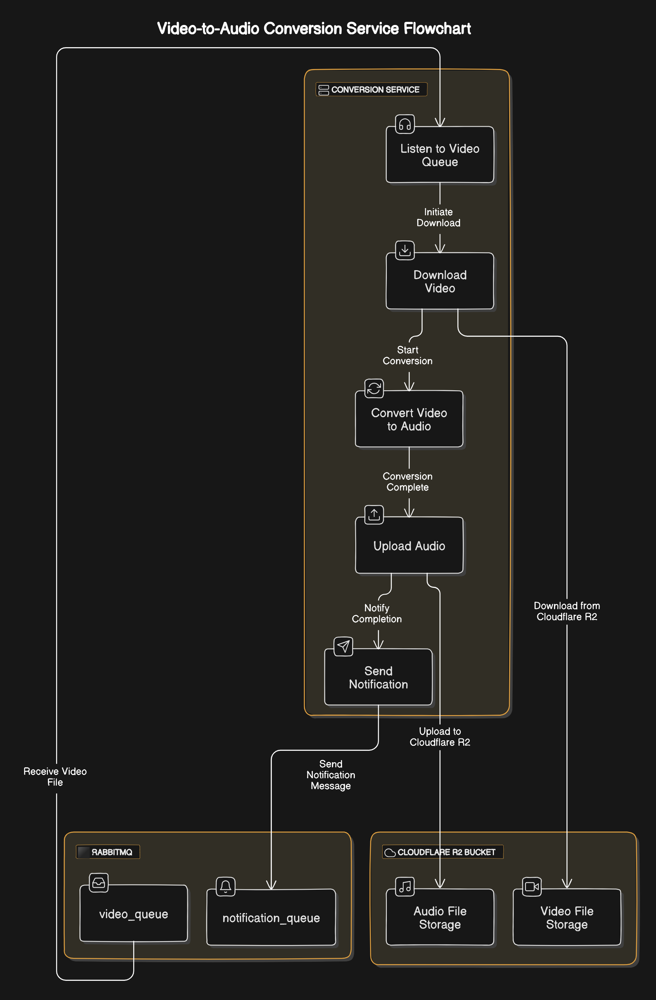

<<<<<<< HEAD


## Arquitetura das APIs


🎧 MP3 Conversion API Gateway
Bem-vindo ao MP3 Conversion API Gateway! Esta API é responsável por centralizar e gerenciar o processo de conversão de arquivos de áudio para o formato MP3. Ela faz a ponte entre diferentes microserviços especializados em tarefas como a conversão de arquivos, compressão e otimização de MP3, além da extração e inserção de metadados.
=======
# Projeto Consumer RabbitMQ
>>>>>>> 267e511575c855e508f667a655f151d4580e4347

Este projeto é um consumidor RabbitMQ que processa vídeos de uma fila, extrai o áudio e envia uma notificação com um link de download temporário.

## Funcionalidades

- **Consome vídeos de uma fila RabbitMQ**
- **Baixa vídeos de um bucket da cloudflare R2**
- **Extrai áudio usando a biblioteca `extract_audio`**
- **Faz o upload do áudio de volta para o bucket**
- **Gera um link de download temporário**
- **Envia uma mensagem para o serviço de notificação com o link do download**

## Estrutura do Projeto
```bash
C:.
├───.github
│   └───workflows
├───core
├───schemas
├───services
├───tests
```

## Docker Container
A aplicação é dockerizada de maneira eficiente utilizando o Docker. O Dockerfile inclui comandos otimizados e cache para garantir uma construção rápida e leve da imagem. Após a construção, a imagem é enviada para o Docker Hub, facilitando o deployment em ambientes de produção e desenvolvimento.
para buildar a imagem localmente
```bash
docker build -t converter_service .
```

## GITOPS e K8S
Este repositório implementa o GitOps em conjunto com o Argo CD. Ele lê a pasta `k8s` na branch `gitops` e automaticamente aplica os manifests no meu cluster Kubernetes. Além disso, a imagem do deployment é automaticamente modificada toda vez que há um commit na branch `master`, refletindo o aumento de versão do projeto.

Para acessar a branch
```bash
git checkout gitops
```
